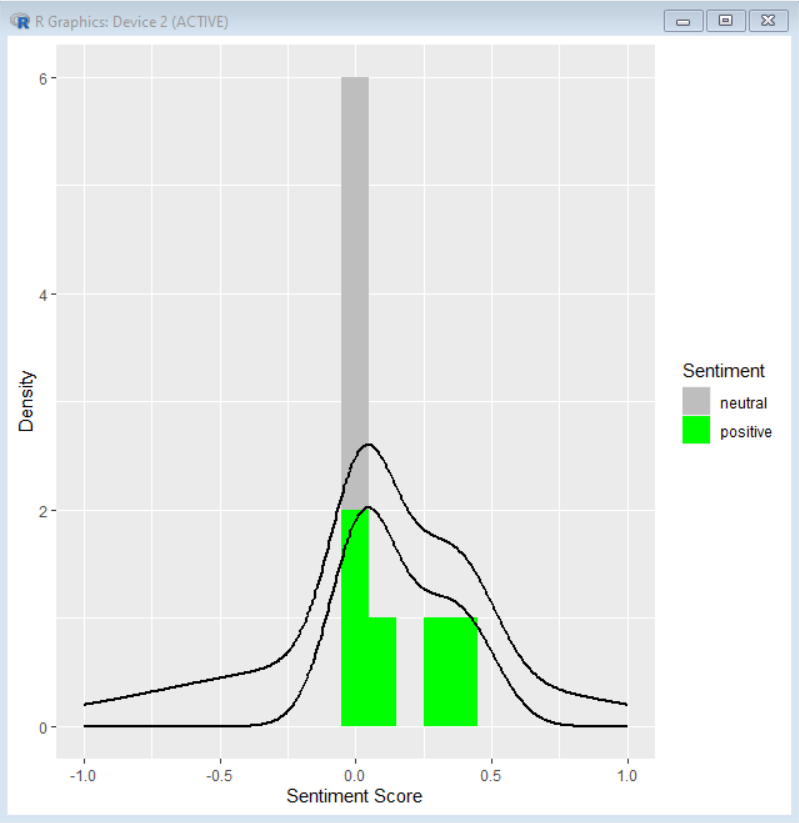
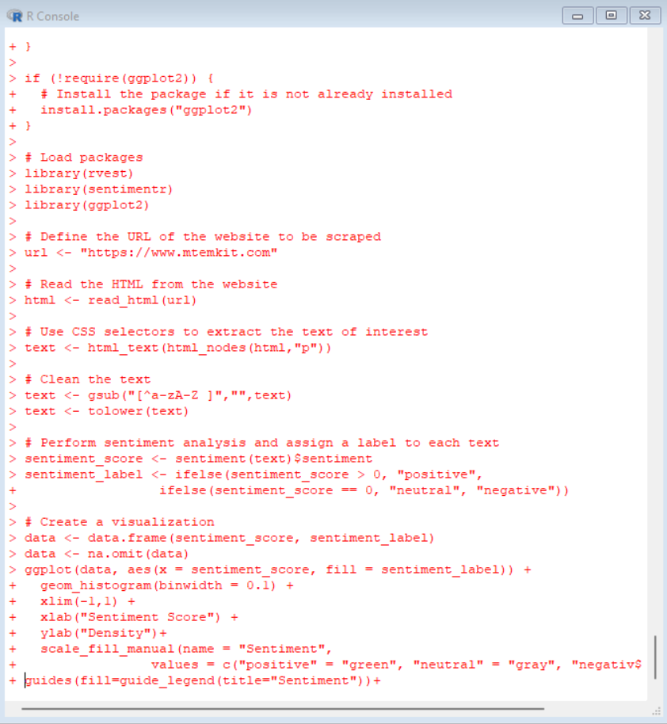

# Website-Sentiment-Analysis-R

### Task

Scrape the text from a website, analyze it, and then display the general sentiment scores (negative, neutral, positive).

### Purpose: 

Using R to execute an original idea while acting as a basic refresher and practical experience with the language.

### Summary:

This script scrapes the text from the website "https://www.mtemkit.com" (can be changed to any site but be aware of their terms of service), performs sentiment analysis on the text using the package "sentimentr", and then creates a histogram to visualize the distribution of sentiment scores with a density line overlay. The script also checks and installs necessary packages if they are not already installed.

### Programming Languages:

R 

### Compatability:

R Version 4.2.2

   

### Live Demo:

Running the script and then displaying the sentiment scores.

   
  

